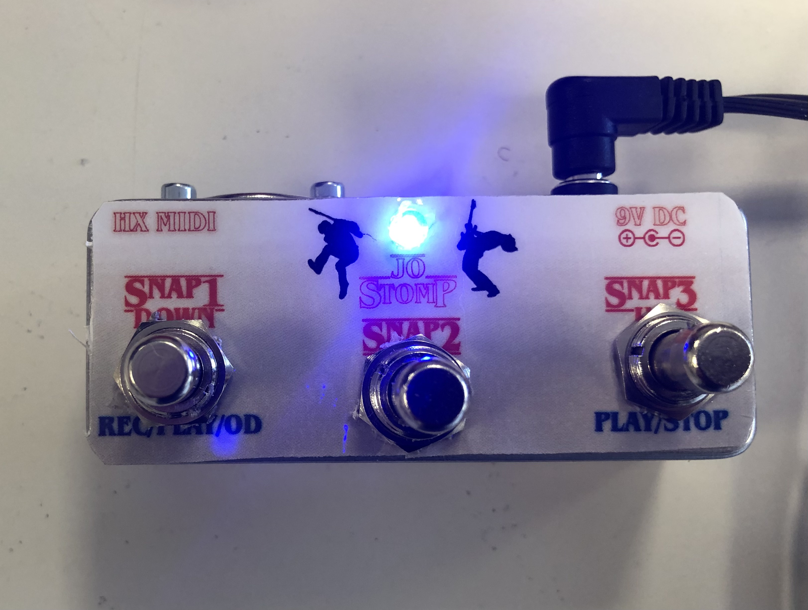
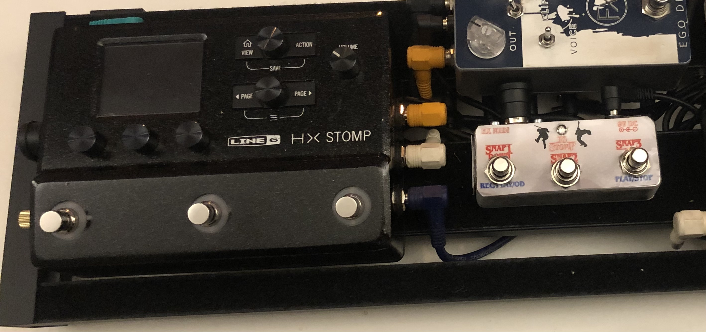
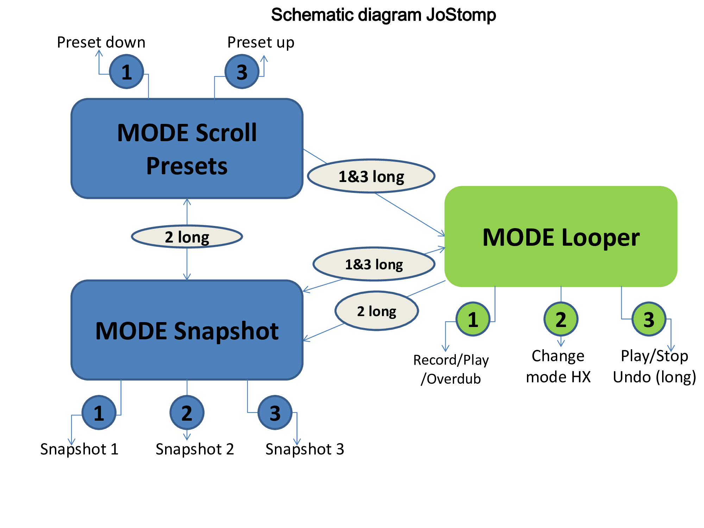
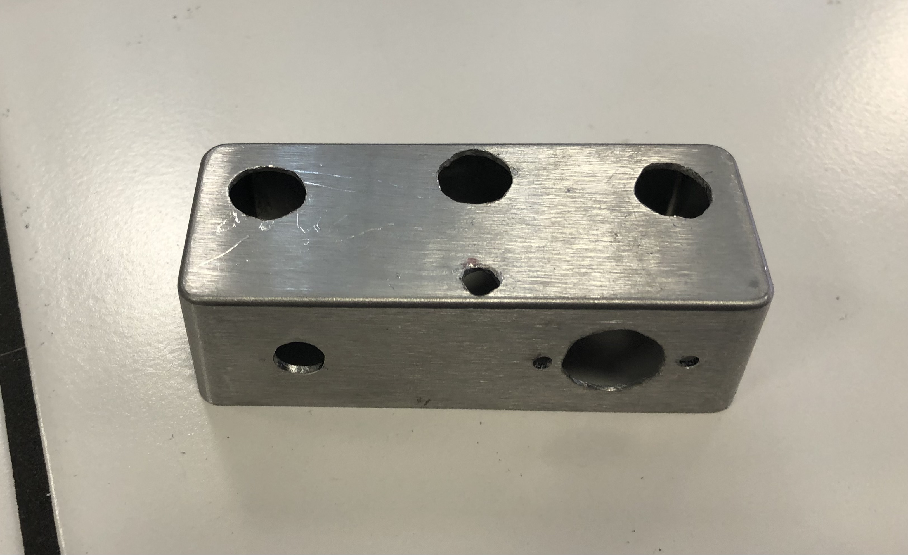
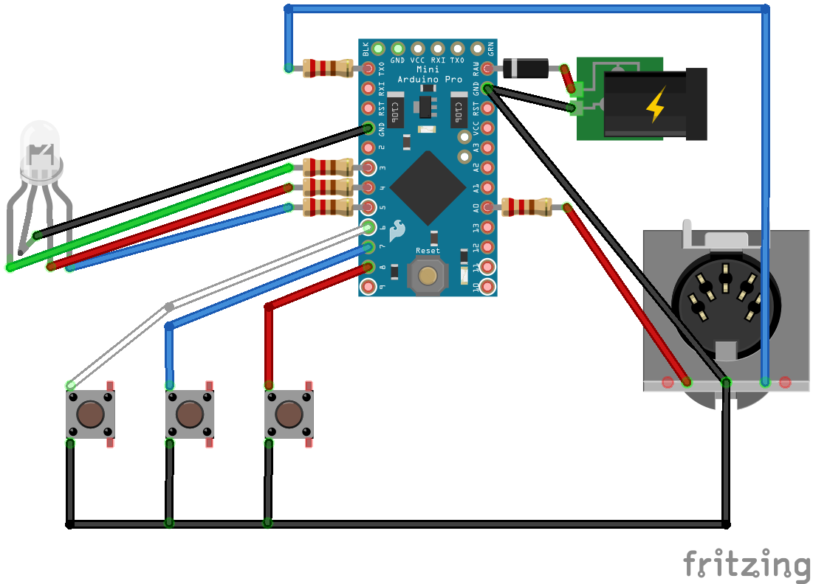
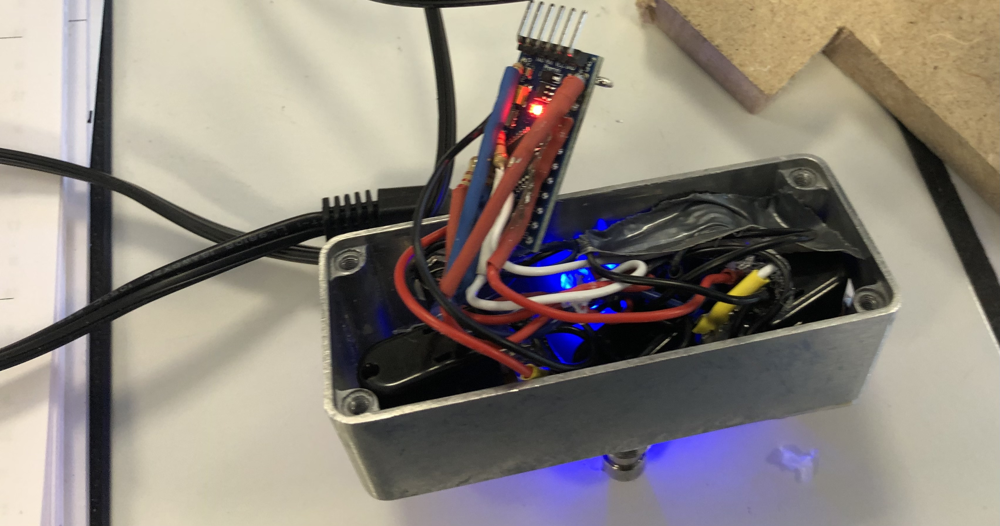
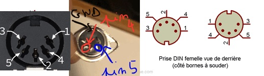
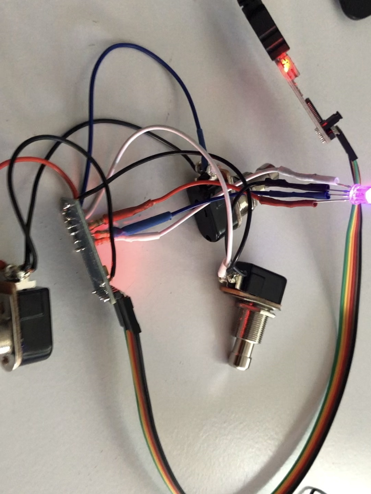

# JoStomp HX

This project is a mini MIDI controller for HX Stomp. It allows easy access to the 3 snapshots of a preset, while retaining the possibility of remaining in Footswitch mode on the HX. This offers many more possibilities et flexibility than a double TRS footswitch.
This pedal is also configured to scroll through the presets and provides access to a mini RC20 type looper.

It's not my work ! I just followed mattzws' advice on this page (the article is incredibly clear and detailed !) :

https://github.com/mattzzw/midi_muppet_hx_2btn

A big thanks to him !

I just customized this pedal by adding a button, then modified the code to suit my needs ;)

The JoStomp HX can

- select the three **snapshots**
- **scroll** up/down through **presets** 
- act as a two button **LOOPER** controller
    
    ... and can do more if we want !
    

## JoStomp Modes

| Mode |  LED  |
|------|-----------------|
| Snapshot| **Green** |
| Scroll preset|  **Red** |
| Looper  |   **Purple** ----------> **FEATURES** ->  Record : **flash red**  -----  Play : **green**  -----  Overdub : **yellow**|

To select a mode (snapshot or scroll presets), press and hold  button **2**

## Using the Modes:
| Mode |  Actions  |
|------|-----------------|
| SCROLL Mode |  <ul><li>buttons **1/3** : preset down/up</li><li>button **2** **long** : mode SNAPSHOT</li><li>buttons **1+3** **both long**: LOOPER mode</li></ul> | 
| SNAPSHOT Mode | <ul><li>buttons **1/2/3** : select snapshot</li><li> button **2** **long** : mode SCROLL</li><li>buttons **1+3** **both long**: LOOPER mode</li></ul> | 
| LOOPER Mode   | <ul><li>button **1** : record/play/overdub</li><li>button **3** : play/stop /undo (**long**)</li><li>button **2** : select mode HX (presets, snapshots, footswitch)</li><li>buttons **1+3** **both long**: mode SNAPSHOT</li><li>button **2** **long** : mode SNAPSHOT</li></ul>      | 
  
                 
                 

## Setting the MIDI Channel
MIDI channel can be set to any value between 1 and 16. HX Stomp listens on channel 1 per default.

To change the MIDI Channel:
- Press and hold button **1** while powering up the J. After a second the device will indicate the currently set MIDI channel by slowly flashing the green LED (1 flash = channel 1, ..., 16 flashes = channel 16).
- Press up to increase the MIDI channel or press dn to decrease the channel.
- Press and hold up and dn to exit MIDI channel configuration.

MIDI Channel configuration will be stored in EEPROM and will be loaded on restart.

## List of components

Global budget : 20 € !

- Stomp case: e.g. Hammond 1590A
- 3 momentary foot switches
- Arduino Pro Mini with programming headers populated (5V)
- MIDI/DIN Socket
- 2,1 mm power Socket
- LED RGB
- 5 x 220R resistors (5V version of Arduino)
- FTDI serial adaptor (for programming)
- Diode IN4147

## Drilling

## Wiring

    
| Component |  Pin  |
|------|-----------------|
| Button 1/2/3| **D6, D7,D8** |
| LED RGB|  green red blue **D3, D4, D5** via **220R** resistor common cathond to ground |
| MIDI **pin 5** (data line) |   **Arduino TX** pin via **220R** resistor|
| MIDI **pin 4** (voltage reference line) |   **Arduino 5V/VCC** pin via **220R** resistor|
| **9V** from Power socket (ext)|   **Arduino RAW** pin via diode (protection)|
| **GND** from Power socket center|   **Arduino GNC** pin |

## A nice little design ;)

## Code Arduino

The code requires the OneButton and the JC_Button library to be installed. You can find them in the Arduino library manager.

## Uploading the code 

Disconnect external power supply first! The FTDI adaptor will provide power.

Hook up the FTDI adaptor to the Arduino board, select "Arduino Pro or Pro Mini" in your Arduino IDE, load the code, compile, upload ... and enjoy !

